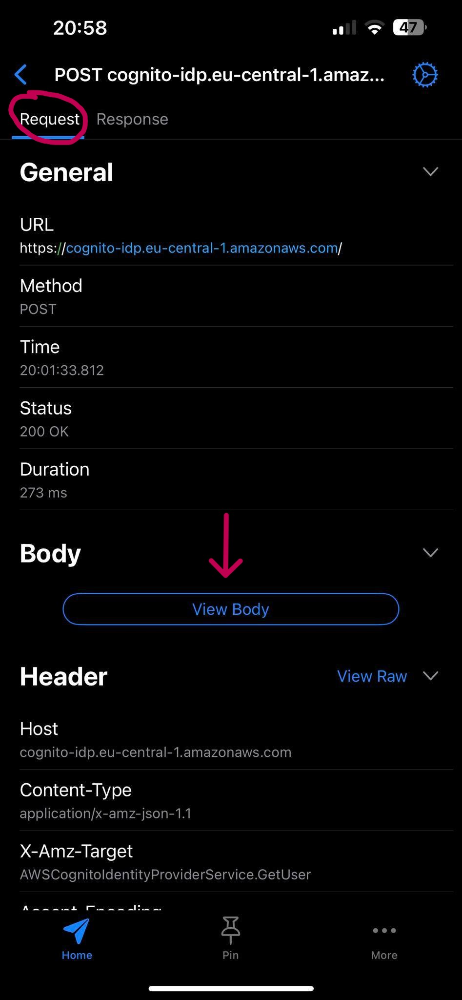
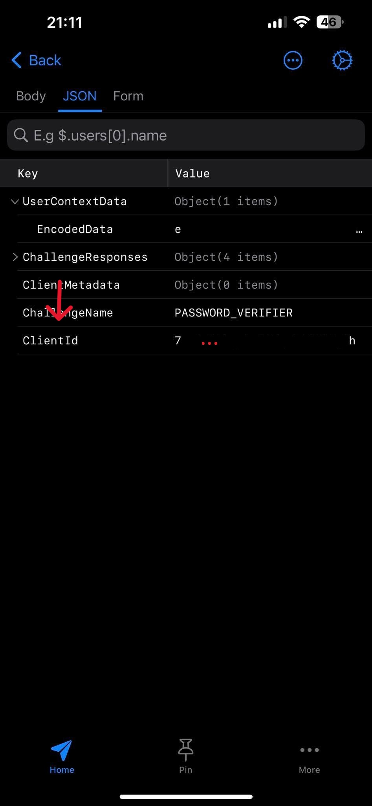
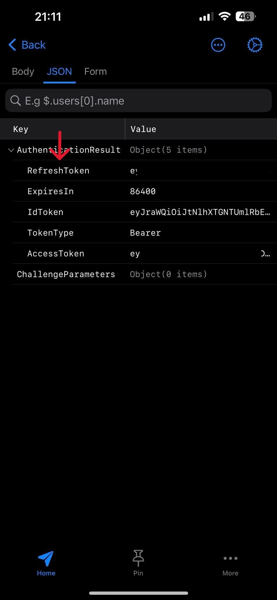

# Edilkamin for Home Assistant

This little integration provides :

- binary sensor :
  - thank pellet
  - check it's already online 
- sensor :
  - get the temperature
  - get the speed of fan 1
  - get nb alarms and date of it
  - get the actual power 
- switch :
  - turn on/off the stove  
  - turn on/off the airkare function
  - turn on/off the relax function
  - turn on/off the chrono mode
  - turn on/off the schedule
- fan :
  - modify the fan 1 speed  
- climate

_Pay attention_ : If the API changes, I cannot guarantee that the integration will continue to work.

## Installation

### Manual Installation
1. Download the latest release.
1. Extract the files and move the `edilakmin` folder into the path to your custom_components. e.g. /config/custom_components.
2. Restart Home Assistant
3. In the home assistant configuration screen click on Integrations.
4. Click on the + icon to add a new integration.
5. Search for `Edilakmin` and select it.
6. Enter the mac address of the stove name and click Submit.

### Installation via Home Assistant Community Store (HACS)
1. Ensure HACS is installed.
1. Add this repo (https://github.com/algra4/ha-edilkamin) has custom repo ([HACS how-to](https://hacs.xyz/docs/faq/custom_repositories))
1. Search for and install the "Edilkamin" integration
2. Restart Home Assistant
3. In the home assistant configuration screen click on Integrations.
4. Click on the + icon to add a new integration.
5. Search for `Edilakmin` and select it.
6. Enter the mac address, client id and the refresh token.

## How to get the information for the integration.

In my case, I used a proxy application (Proxyman on IOS).
* Start the vpn
* Use `The Mind` application.
  * Make a logout-login 
* On the proxy application many requests. 
  * Find the request with the url -> `https://cognito-idp.eu-central-1.amazonaws.com/` 
    

    
Get the <b>clientId</b>

  
      1. Open the request and show the body: 
      2. Get the content of `ClientId`: 
    

    

    
Get the <b>refresh token</b>

  
      1. Open the response and show the body: 
      2. Get the content of `ClientId`: 
    

  *  Get the **mac address**: Select one request with this url `https://fxtj7xkgc6.execute-api.eu-central-1.amazonaws.com` and in the body we have the value for the mac address

## Tested device :

- Myrna 
  - motherboard : `1.58.201215a` - `1.0.200824a`
  - wifi_ble_module : `1.0_20` - `1.0.200824a`

## Todo:

- [x] validate mac address provided 
- [ ] create test

