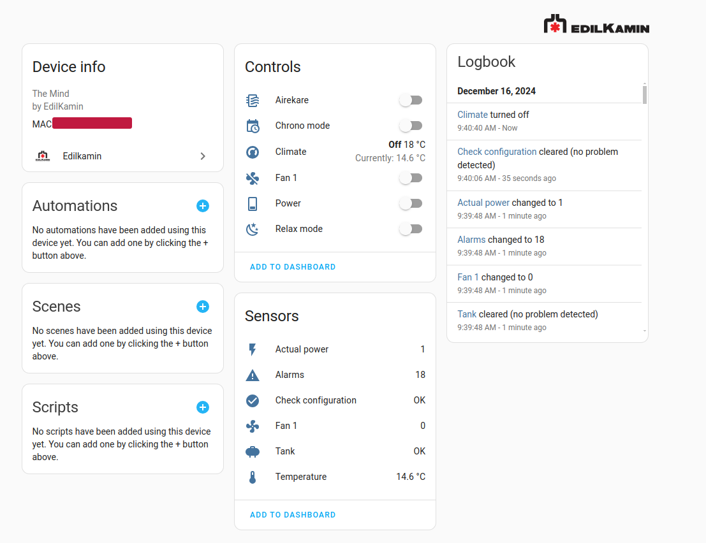

# Edilkamin for Home Assistant

- [Edilkamin for Home Assistant](#edilkamin-for-home-assistant)
  - [Available sensors](#available-sensors)
    - [Binary sensors](#binary-sensors)
    - [Climate](#climate)
    - [Fan](#fan)
    - [Sensors](#sensors)
    - [Switches](#switches)
  - [Installation](#installation)
    - [Installation via HACS (recommended)](#installation-via-hacs-recommended)
  - [Automations](#automations)
    - [Send notification when the tank is empty](#send-notification-when-the-tank-is-empty)
  - [Send notification whe the tank has been refill](#send-notification-whe-the-tank-has-been-refill)
  - [Tested device](#tested-device)
  - [External dependencies](#external-dependencies)
  - [Thanks](#thanks)





> [!WARNING]  
> If the API changes, I can't guarantee that the integration will continue to work.

## Available sensors

### Binary sensors

| Name    | Description |
| -------- | ------- |
| `Check configuration`  | Check if the pellet stove is available via api   |
| `Tank`  | Give the information if the pellet stove must be refill or not   |

### Climate

The climate entity is able to:
- select the target temperature
- switch the mode
  - off
  - heat
- select the preset
  - auto
  - manual p1
  - manual p2
  - manual p3
  - manual p4
  - manual p5
- control the main fan

### Fan
The Integration creates the number of fans depending on the pellet stove

| Name    | Description |
| -------- | ------- |
| `Fan ${index}`  |  Manage the fan   |

### Sensors

| Name    | Description | Unit
| -------- | ------- | ------- |
| `Temperature`  |  The actual temperature   | celsius |
| `Fan ${index}`  |  The fan speed  | int |
| `Nb alarms`  |  The number of alarms | int |
| `Actual power`  |  The pover of the pellet stove | int |
| `Operational phase`  |  The phase of the pellet stove | Off, Ignition, On, Shutdown, Cooling, Alarm, Final cleaning, Unknown |
| `Autonomy`  |  Time remaining before the pellet stove turns off if no pellets are added | minute |
| `Power ons`  |  Number of times the pellet stove has been turn on | int |

### Switches

| Name    | Description |
| -------- | ------- |
| `Airekare`  |  Switch the airekare mode   |
| `Chrono mode` | Switch the chrono mode     |
| `Relax mode`    | Switch the relax mode    |
| `Stand by mode`    | Switch the stand by mode. <br> When the Stand-by function is active, in the automatic and crono modes, the product switches off once the temperature set-point is reached and turns on again when the room temperature drops below the chosen value    |


## Installation

Click on this button:

[](https://my.home-assistant.io/redirect/hacs_repository/?owner=algra4&repository=ha-edilkamin&category=integration)


### Installation via HACS (recommended)
1. Ensure HACS is installed.
1. Add this repo (https://github.com/algra4/ha-edilkamin) has custom repo ([HACS how-to](https://hacs.xyz/docs/faq/custom_repositories))
1. Search for and install the "Edilkamin" integration
2. Restart Home Assistant
3. In the home assistant configuration screen click on Integrations.
4. Click on the + icon to add a new integration.
5. Search for `Edilakmin` and select it.
6. Enter the mac address, username and password.

<details>
  <summary>Manual Installation</summary>
  
  1. Download the latest release.
  2. Extract the files and move the `edilakmin` folder into the path to your custom_components. e.g. /config/custom_components.
  3. Restart Home Assistant
  4. In the home assistant configuration screen click on Integrations.
  5. Click on the + icon to add a new integration.
  6. Search for `Edilakmin` and select it.
  7. Enter the mac address of the pellet stove name and click Submit.
</details>


## Automations

### Send notification when the tank is empty

```yaml
alias: Tank empty
triggers:
  - type: problem
    device_id: f892184070f74cfbf812bb4000cd1c58 # id of the Edilkamindevice
    entity_id: be3da6cdd182ec44f8ac6ba68e28997e # id of the binary_sensor tank 
    domain: binary_sensor
    trigger: device
actions:
  - action: notify.notify
    metadata: {}
    data:
      message: The pellet tank is almost empty, so it's time to feed it.
      title: 🔥 Pellet stove 🔥
mode: single

```

## Send notification whe the tank has been refill

```yaml
alias: Tank full
triggers:
  - type: no_problem
    device_id: f892184070f74cfbf812bb4000cd1c58 # id of the Edilkamindevice
    entity_id: be3da6cdd182ec44f8ac6ba68e28997e # id of the binary_sensor tank 
    domain: binary_sensor
    trigger: device
actions:
  - action: notify.notify
    metadata: {}
    data:
      message: The pellet tank has been filled
      title: 🔥 Pellet stove 🔥
mode: single
```

## Tested device

- Myrna 
  - motherboard : `1.58.201215a` - `1.0.200824a`
  - wifi_ble_module : `1.0_20` - `1.0.200824a`
 
- Blade H
  - platine firmware : `4.1.240802a`
  - core control pan : `4.1.241010a`

## External dependencies

- This project uses the  [edilkamin.py](https://github.com/AndreMiras/edilkamin.py) under MIT licence thanks to @AndreMiras

## Thanks
- thanks to [@nghaye](https://github.com/nghaye/ha-edilkamin) for some inspiration to improve integration


